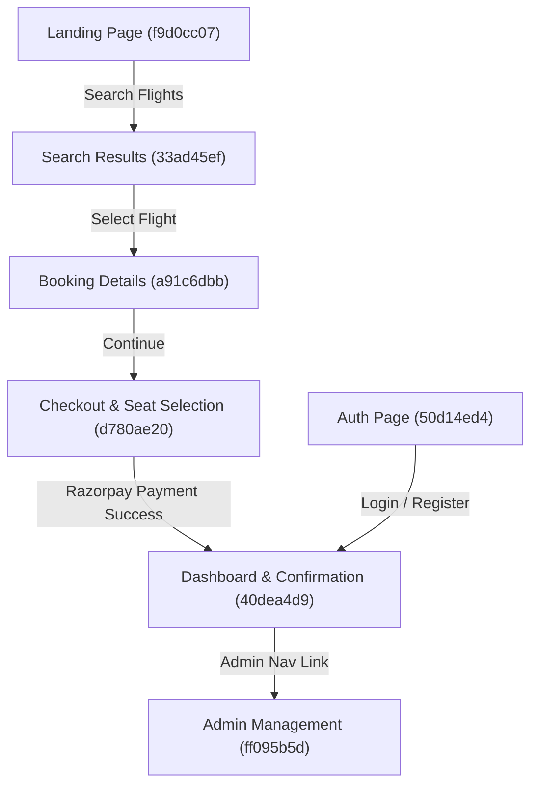

# STITCH-ANGULAR-MAPPING.md
## Architecture Mapping: Stitch Screens → Angular Components → Backend APIs
**Project Name**: SkyRoute Premium Flight Management  
**Stitch Project ID**: `6969113012666830143`

---

## 1. Executive Summary & Page Flow Diagram

---

## 2. Screen-by-Screen Mapping Specification

### Screen 1: SkyRoute | Landing Page
- **Stitch Screen ID**: `f9d0cc07856e4276bb42024b7b6e41de`
- **Angular Route**: `/` or `/home`
- **Angular Component**: `LandingComponent` (`src/app/features/landing/landing.component.ts`)
- **Reusable UI Components**:
  - `TopNavBarComponent` (`src/app/shared/components/top-nav-bar/top-nav-bar.component.ts`)
  - `FooterComponent` (`src/app/shared/components/footer/footer.component.ts`)
  - `FlightSearchWidgetComponent` (`src/app/shared/components/flight-search-widget/flight-search-widget.component.ts`)
  - `DestinationCardComponent` (`src/app/features/landing/components/destination-card.component.ts`)
- **Backend APIs Needed**:
  - `GET /api/airports` - Airport code/city autocomplete
  - `GET /api/flights/search` - Search execution redirection

---

### Screen 2: SkyRoute | Search Results
- **Stitch Screen ID**: `33ad45efbe1d4b4e9d9602b5b433fdb0`
- **Angular Route**: `/flights` or `/flights/search`
- **Angular Component**: `FlightListComponent` (`src/app/features/flights/flight-list/flight-list.component.ts`)
- **Reusable UI Components**:
  - `TopNavBarComponent`
  - `FooterComponent`
  - `FlightFilterSidebarComponent` (`src/app/features/flights/components/flight-filter-sidebar.component.ts`)
  - `FlightCardComponent` (`src/app/features/flights/components/flight-card.component.ts`)
  - `SearchSummaryHeaderComponent`
  - `SortBarComponent`
- **Backend APIs Needed**:
  - `GET /api/flights/search` (Query Params: `source`, `destination`, `departureDate`, `passengers`, `cabinClass`, `minPrice`, `maxPrice`, `stops`, `airlines`, `page`, `size`, `sort`)
  - `GET /api/airports`
  - `GET /api/airlines`

---

### Screen 3: SkyRoute | Booking Details
- **Stitch Screen ID**: `a91c6dbb85f6463b88c8b6cd4d0aa5af`
- **Angular Route**: `/bookings/details` or `/flights/:id/book`
- **Angular Component**: `PassengerInfoComponent` (`src/app/features/bookings/passenger-info/passenger-info.component.ts`)
- **Reusable UI Components**:
  - `TopNavBarComponent`
  - `FooterComponent`
  - `FlightSummaryCardComponent`
  - `PassengerFormComponent`
  - `PriceBreakdownCardComponent`
- **Backend APIs Needed**:
  - `GET /api/flights/{id}` - Retrieve detailed flight specification
  - `POST /api/seat-locks/lock` - Initiate temporary 10-minute seat lock

---

### Screen 4: SkyRoute | Checkout (Seat Selection & Payment)
- **Stitch Screen ID**: `d780ae2068e24a42bcd5f15d059beeb7`
- **Angular Route**: `/checkout` or `/bookings/checkout`
- **Angular Component**: `CheckoutComponent` (`src/app/features/bookings/checkout/checkout.component.ts`)
- **Reusable UI Components**:
  - `CheckoutHeaderComponent`
  - `StepIndicatorComponent`
  - `SeatMapGridComponent` (`src/app/features/bookings/components/seat-map-grid.component.ts`)
  - `PaymentFormCardComponent`
  - `BookingSummaryPanelComponent`
- **Backend APIs Needed**:
  - `GET /api/seat-locks/flight/{flightId}` - Fetch locked & occupied seats for aircraft layout
  - `POST /api/seat-locks/lock` - Acquire seat lock
  - `POST /api/bookings` - Create pending booking & passenger records
  - `POST /api/payments/create-order` - Generate Razorpay Payment Order ID
  - `POST /api/payments/verify` - Verify Razorpay signature & issue ticket

---

### Screen 5: SkyRoute | Dashboard & Success
- **Stitch Screen ID**: `40dea4d9275f44b28525df138b24427f`
- **Angular Route**: `/dashboard` & `/bookings/confirmation/:id`
- **Angular Component**: `UserDashboardComponent` (`src/app/features/dashboard/user-dashboard.component.ts`) & `BookingConfirmationComponent`
- **Reusable UI Components**:
  - `SideNavShellComponent` (`src/app/shared/components/side-nav-shell/side-nav-shell.component.ts`)
  - `ConfirmationBannerComponent`
  - `UpcomingTripCardComponent`
  - `QuickSearchWidgetComponent`
  - `RecentActivityListComponent`
- **Backend APIs Needed**:
  - `GET /api/bookings/my-bookings` - Retrieve user's bookings
  - `GET /api/bookings/{id}` - Retrieve specific booking confirmation & passenger details
  - `GET /api/notifications` - Retrieve user alerts

---

### Screen 6: SkyRoute | Authentication
- **Stitch Screen ID**: `50d14ed427d9485f831bb2848b5bac5e`
- **Angular Route**: `/login`, `/register`, `/verify-email`
- **Angular Component**: `LoginComponent`, `RegisterComponent`, `VerifyEmailComponent` (`src/app/features/auth/`)
- **Reusable UI Components**:
  - `AuthHeroSideComponent`
  - `AuthLogoHeaderComponent`
  - `LoginFormCardComponent`
  - `RegisterFormCardComponent`
  - `OtpVerificationModalComponent`
- **Backend APIs Needed**:
  - `POST /auth/login` - Authenticate user credentials
  - `POST /auth/register` - Register new user account
  - `POST /auth/verify-email` - Verify email OTP
  - `POST /auth/refresh-token` - Interceptor token refresh

---

### Screen 7: SkyRoute | Admin Management
- **Stitch Screen ID**: `ff095b5d133b4d1e9c464cf39f2fe42e`
- **Angular Route**: `/admin`, `/admin/flights`, `/admin/airports`, `/admin/airlines`
- **Angular Component**: `AdminDashboardComponent` (`src/app/features/admin/admin-dashboard.component.ts`)
- **Reusable UI Components**:
  - `SideNavShellComponent`
  - `AdminHeaderComponent`
  - `KpiBentoGridComponent`
  - `FlightManagementTableComponent`
  - `SystemLogsPanelComponent`
- **Backend APIs Needed**:
  - `GET /api/bookings/admin/stats` - System KPI metrics
  - `GET /api/flights` & `POST /api/flights` - Flight schedule management
  - `GET /api/airports` & `POST /api/airports` - Airport management
  - `GET /api/airlines` & `POST /api/airlines` - Airline management

---

## 3. Reusable Component Hierarchy Summary

| Component Name | Type | Used In Screens | Responsibilities |
|---|---|---|---|
| `TopNavBarComponent` | Shared Header | Landing, Search Results, Booking Details | Top brand logo, nav links, utility search/notifications, auth buttons |
| `SideNavShellComponent` | Shared Sidebar | Dashboard, Admin Management | Dark Navy (#131b2e) fixed 280px sidebar, section links, logout CTA |
| `FooterComponent` | Shared Footer | Landing, Search Results, Booking Details | Copyright, company links, legal & social links |
| `FlightSearchWidgetComponent` | Shared Form | Landing, Dashboard Quick Search | Trip type radio, passenger count, origin/destination inputs, search button |
| `FlightCardComponent` | Shared UI | Search Results | Flight row layout, airline logo, times, direct badge, price, select button |
| `SeatMapGridComponent` | Specialized UI | Checkout | Interactive 6-abreast aircraft fuselage seat selection grid |
